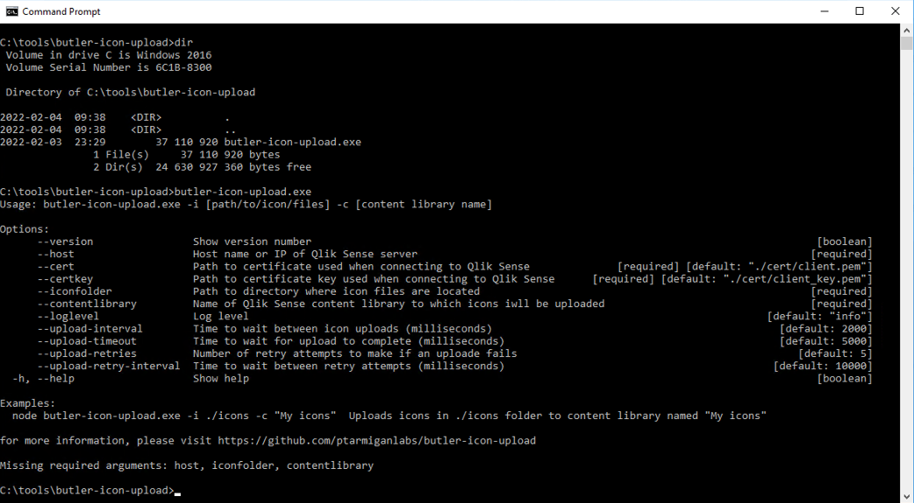
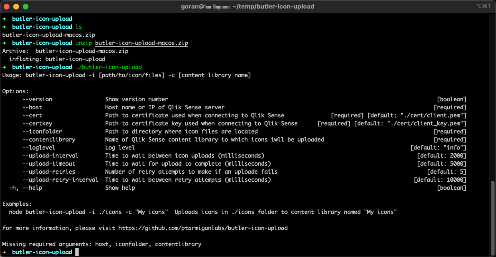
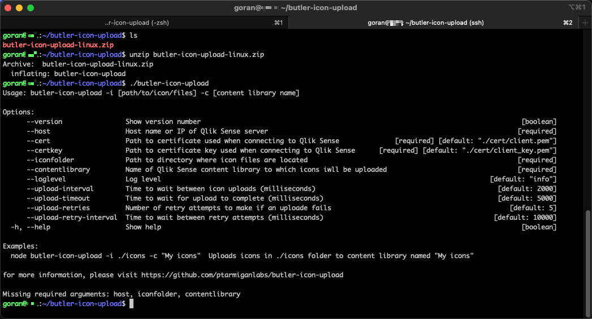
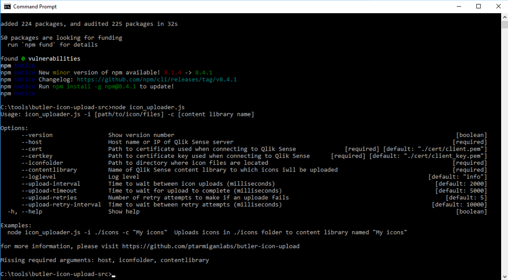
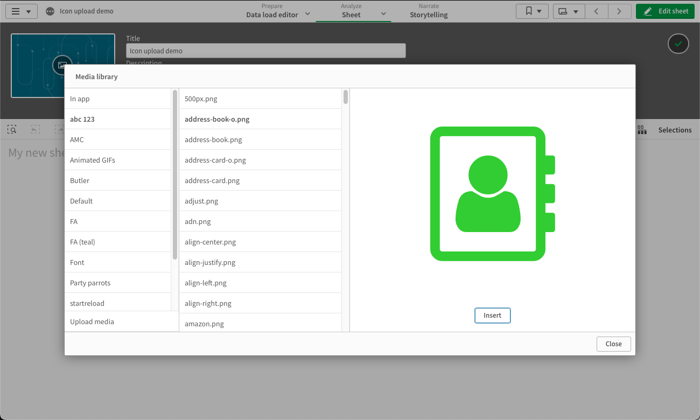

<h1 align="center">

</h1>
<h3 align="center">Butler Icon Upload makes it easy to use free, professional quality icons and images in Qlik Sense Enterprise on Windows</h3>
<p align="center">
<a href="LICENSE"></a>
<a href="https://github.com/ptarmiganlabs/butler-icon-upload"></a>
<a href="https://github.com/ptarmiganlabs/butler-icon-upload/actions/workflows/release-please.yml"></a>
</p>
<br>
<br>
<br>
<br>

# Features

* Thousands of free icons available, including Google Material Design, Font Awesome and others.
* Batch upload of icons and images to Qlik Sense. No more 50-at-a-time uploads.
* Stand-alone executables available for Windows, Linux, Alpine Linux and macOS.
* The tool was created with Qlik Sense Enterprise on Windows.

# Table of contents

- [Features](#features)
- [Table of contents](#table-of-contents)
- [Installation](#installation)
  - [Extract icon files from icon fonts](#extract-icon-files-from-icon-fonts)
  - [Convert icons files to correct format](#convert-icons-files-to-correct-format)
  - [Installing Butler Sheet Icons](#installing-butler-sheet-icons)
    - [Stand-alone executables](#stand-alone-executables)
    - [Node.js application](#nodejs-application)
- [Finding icons](#finding-icons)
  - [Download icons](#download-icons)
- [Convert icons to bitmaps](#convert-icons-to-bitmaps)
- [Uploading icons to Qlik Sense](#uploading-icons-to-qlik-sense)
  - [Certificates](#certificates)
  - [Uploading icons](#uploading-icons)
- [Troubleshooting](#troubleshooting)
- [Changelog](#changelog)
- [References & resources](#references--resources)

# Installation

Installation can be done in two ways.  
Which to use is a matter of preference, both achieve the same thing: images uploaded to Qlik Sense.

If you already have Node.js installed on the computer where you will use Butler Icon Upload, you can save some disk space by using the Node.js version of the tool.  
If you on the other hand want the easiest possible setup process the stand-alone executable is the way to go.

There are a few pre-requisites that are common for both installation options, these are described first.

## Extract icon files from icon fonts

If you want to convert existing icon fonts to bitmap images, you need to install [Icon Font to PNG](https://github.com/Pythonity/icon-font-to-png).  
This tool is not needed if your images are already in bitmap (png) format.

Let's try it:

```bash
proton:butler-icon-upload goran$ icon-font-to-png
usage: icon-font-to-png [-h] [--list] [--download {font-awesome,octicons}]
                        [--ttf TTF-FILE] [--css CSS-FILE] [--size SIZE]
                        [--scale SCALE] [--color COLOR] [--filename FILENAME]
                        [--keep_prefix]
                        [icons [icons ...]]
icon-font-to-png: error: You have to provide CSS and TTF files
```

## Convert icons files to correct format

[ImageMagick](https://www.imagemagick.org) is a very powerful tool for working with image files.  
It may be difficult to run ImageMagick on a Windows computer, so Linux or OSX is recommended.

ImageMagick is used to modify the images so they get the correct size and aspect ratio for use as sheet icons.  
If this step is not done square images will appear as stretched when used as sheet icons.

```bash
➜  butler-icon-upload convert
Version: ImageMagick 7.1.0-19 Q16-HDRI x86_64 2021-12-22 https://imagemagick.org
Copyright: (C) 1999-2021 ImageMagick Studio LLC
License: https://imagemagick.org/script/license.php
Features: Cipher DPC HDRI Modules OpenMP(5.0)
Delegates (built-in): bzlib fontconfig freetype gslib heic jng jp2 jpeg lcms lqr ltdl lzma openexr png ps tiff webp xml zlib
Compiler: gcc (4.2)
Usage: convert [options ...] file [ [options ...] file ...] [options ...] file

Image Settings:
  -adjoin              join images into a single multi-image file
  -affine matrix       affine transform matrix
  -alpha option        activate, deactivate, reset, or set the alpha channel
  -antialias           remove pixel-aliasing
...
```

## Installing Butler Sheet Icons

### Stand-alone executables

This option is easiest to get started with.  
It uses stand-alone executable files that include everything needed to run Butler Icon Upload.  

On the [release page](https://github.com/ptarmiganlabs/butler-icon-upload/releases/latest) you find ZIP files with executables for Windows, Linux and macOS.

The macOS file is signed and notarized by Apple, which means it will run on all modern versions of macOS, including Macs with M1 silicon inside.

Running the stand-alone tool on Windows Server 2016 looks like this:



Same thing on macOS:



And Linux (Ubuntu 18.04.6 LTS):



### Node.js application

Butler Icon Upload is built using Node.js and thus require Node.js installed.  
Please refer to the [Node.js site](https://nodejs.org/en/) for installation instructions for your platform (OSX/Windows/Linux).  
The latest LTS version of Node.js is usually a good choice.  

With that in place, you should install the actual upload tool.

* Download the source code from the [releases page](https://github.com/ptarmiganlabs/butler-icon-upload/releases/latest).
* Unzip to suitable location, for example ~/butler-icon-upload. cd into this directory.
* Install dependencies by running `npm install`.

Test your work so far. On Windows Server you should see something like this:



Great! You now have the tools needed to batch convert and upload icons and images to Qlik Sense.

# Finding icons

The Butler Icon Upload tool does not include any actual icons.  
You need to find these elsewhere.

The good news is that there are various online resources from where you can download professional quality icon sets.  
Some of the more commonly used icon sets are Google's [Material Design](https://material.io/icons/) and [Font Awesome](https://fontawesome.com/), but there are many others too.

If you download icons from some online source, you need to get a) a css file for the webfont, and b) the webfont file itself.

## Download icons

[IcoMoon](https://icomoon.io/app/#/select) works great for getting the needed icon resources.  
It is basically a web app that wraps some of the most common icon sets in a web UI.  
Select the icons you want - let it be 5 or 500 - click download and you are done.
The app also offers IcoMoon's own icon sets for purchase.

IcoMoon is very easy to use, but let's take a look at how the hundreds of icons in Font Awesome can be downloaded:

1. Go to IcoMoon's [selection page](https://icomoon.io/app/#/select).
2. The "IcoMoon - Free" icon set has been pre-selected for you. Remove it by opening the hamburger menu in upper right corner, then select "Remove Set".
3. Click the "Add Icons From Library" link at the bottom of the page.
4. Scroll down until you find the Font Awesome library. Add it.
5. Select the icons you are interested in, or select all icons by clicking the hamburger menu to the right, then "Select All".
6. Click the "Generate Font" link in the lower right corner of the screen.
7. After a few seconds you will get a download link. Click it to download the icons.
8. You now have a file called icomoon.zip. Unzip it to for example ~/butler-icon-upload/fonts/fontawesome. cd to that directory.

We are only interested in the style.css and fonts/icomoon.ttf files, the rest can be deleted.

# Convert icons to bitmaps

You are now ready to convert the icon webfonts to bitmap images.

First make sure you are in the correct place (example is using macOS):

```bash
➜  fontawesome pwd
/Users/goran/temp/butler-icon-upload/fonts/fontawesome
➜  fontawesome ls -la
total 80
drwx------  4 goran  staff    128 Feb  4 13:29 .
drwxr-xr-x  4 goran  staff    128 Feb  4 13:16 ..
drwxr-xr-x  3 goran  staff     96 Feb  4 13:28 fonts
-rw-rw-r--@ 1 goran  staff  37887 Feb  4 13:14 style.css
➜  fontawesome ls -la fonts
total 360
drwxr-xr-x  3 goran  staff      96 Feb  4 13:28 .
drwx------  4 goran  staff     128 Feb  4 13:29 ..
-rw-rw-r--@ 1 goran  staff  184196 Feb  4 13:14 icomoon.ttf
➜  fontawesome
```

Then run a small script in the `script` directory that will

1. Extract the images from the icon fonts. The square, exported images will be placed in a new folder called "exported".
2. Convert the images to the size and aspect ratio used by Qlik Sense sheet icons. The resulting images will be placed in a directory called "thumbnail".

The example below uses the stand-alone version of Butler Icon Upload.

The conversion script is not included here, which means you either need to do either of

* Get the script from the GitHub repository ([link](https://github.com/ptarmiganlabs/butler-icon-upload/tree/master/script), place it in the same folder as the `butler-icon-upload` executable)
* Run the commands in the script directly from the command line. That is what the examples below does.

Let's run the first command, which is to extract png image files for all icons in the icon library.  
In this example the generated images will be 256x256 pixels and in color "limegreen".  
A list of possible colors is found [here](https://matplotlib.org/examples/color/named_colors.html).

```bash
➜  fontawesome pwd
/Users/goran/temp/butler-icon-upload/fonts/fontawesome
➜  fontawesome ls -la
total 80
drwx------  4 goran  staff    128 Feb  4 14:07 .
drwxr-xr-x  4 goran  staff    128 Feb  4 13:16 ..
drwxr-xr-x  3 goran  staff     96 Feb  4 13:28 fonts
-rw-rw-r--@ 1 goran  staff  37887 Feb  4 13:14 style.css
➜  fontawesome icon-font-to-png --css style.css --ttf fonts/icomoon.ttf --size 256 --color "limegreen" ALL
Exporting icon '500px' as '500px.png'(256x256 pixels)
Exporting icon 'address-book' as 'address-book.png'(256x256 pixels)
...
...
Exporting icon 'youtube-play' as 'youtube-play.png'(256x256 pixels)
Exporting icon 'youtube-square' as 'youtube-square.png'(256x256 pixels)

All done
➜  fontawesome
```

Next step is to change the aspect ratio (410x270 pixels) of the png files, to make them show up correctly when used as Qlik Sense sheet icons.  
If you only want square images this step is not needed.

```bash
➜  fontawesome pwd
/Users/goran/temp/butler-icon-upload/fonts/fontawesome
➜  fontawesome ls -la
total 96
drwx------    6 goran  staff    192 Feb  4 14:12 .
drwxr-xr-x    4 goran  staff    128 Feb  4 13:16 ..
drwxr-xr-x  788 goran  staff  25216 Feb  4 14:08 exported
drwxr-xr-x    3 goran  staff     96 Feb  4 13:28 fonts
-rw-rw-r--@   1 goran  staff  37887 Feb  4 13:14 style.css
➜  fontawesome mkdir thumbnail
➜  fontawesome cd exported
➜  exported for f in *.png; do echo "$f"; convert $f -gravity center -extent 410x270 "../thumbnail/$f"; done
500px.png
address-book-o.png
address-book.png
...
...
youtube-square.png
youtube.png
➜  exported
```

The `thumbnail` folder now contains images suitable for use as Qlik Sense sheet icons.

# Uploading icons to Qlik Sense

All features, options and parameters described below are identical between two ways of running Butler Icon Upload.  
The only thing differing is wheather the tool is started with `butler_icon_upload` or `node icon_uploader.js`.

## Certificates

The upload tool relies on certificates to authenticate with Qlik Sense. Use the Qlik Management Console to export the certificates.

Note!  
Using certificates is powerful and convenient, but you should be careful with the certificates - if they get in the wrong hand they will provide full access to your Sense environment.

Thus keep tight control of them and always maintain strict firewall rules on your Sense server(s).  
This helps ensuring that access is only possible from desired network locations.

## Uploading icons

Before uploading the images to a Sense content library, please keep a couple of things in mind:

* The content library you upload images to must exist. You will get an error if it doesn't.
* Existing images in the content library will be replaced if you upload new images with same names as existing ones.
* Remember to set a suitable security rule on the content library, so (all or some) users can access the images.

First let's see what version of the tool we have and what the available options are.

```PowerShell
PS C:\tools\butler-icon-upload> .\butler-icon-upload.exe --version
3.1.2
PS C:\tools\butler-icon-upload> .\butler-icon-upload.exe --help
Usage: butler-icon-upload.exe -i [path/to/icon/files] -c [content library name]

Options:
      --version                Show version number                                                                                 [boolean]
      --host                   Host name or IP of Qlik Sense server                                                               [required]
      --cert                   Path to certificate used when connecting to Qlik Sense              [required] [default: "./cert/client.pem"]
      --certkey                Path to certificate key used when connecting to Qlik Sense      [required] [default: "./cert/client_key.pem"]
      --iconfolder             Path to directory where icon files are located                                                     [required]
      --contentlibrary         Name of Qlik Sense content library to which icons iwll be uploaded                                 [required]
      --loglevel               Log level                                                                                   [default: "info"]
      --upload-interval        Time to wait between icon uploads (milliseconds)                                              [default: 2000]
      --upload-timeout         Time to wait for upload to complete (milliseconds)                                            [default: 5000]
      --upload-retries         Number of retry attempts to make if an uploade fails                                             [default: 5]
      --upload-retry-interval  Time to wait between retry attempts (milliseconds)                                           [default: 10000]
  -h, --help                   Show help                                                                                           [boolean]

Examples:
  node butler-icon-upload.exe -i ./icons -c "My icons"  Uploads icons in ./icons folder to content library named "My icons"

for more information, please visit https://github.com/ptarmiganlabs/butler-icon-upload
PS C:\tools\butler-icon-upload>
```

Let's upload the FontAwesome images to a content library called "abc 1232 using PowerShell on a Windows Server 2016 with a one second (1000 ms) pause between each upload.

Depending on how the Sense server is configured it may return rate limit errors after a while, that's fine and Butler Icon Upload will retry up to `--upload-retries` times, with `--upload-retry-interval` milliseconds between retries.

```powershell
PS C:\tools\butler-icon-upload> .\butler-icon-upload.exe --host 10.11.12.13 --cert ../path/to/client.pem --certkey ../path/to/client_key.pem --contentli
brary "abc 123" --iconfolder ./fonts/fontawesome/thumbnail --upload-interval 1000 --loglevel info
2022-02-04T14:09:13.919Z info: --------------------------------------
2022-02-04T14:09:13.921Z info: Starting Qlik Sense icon uploader
2022-02-04T14:09:13.923Z info: Log level: info
2022-02-04T14:09:13.924Z info: App version: 3.1.2
2022-02-04T14:09:13.925Z info: --------------------------------------
2022-02-04T14:09:13.925Z info: Using icons in folder: C:\tools\butler-icon-upload\fonts\fontawesome\thumbnail
2022-02-04T14:09:13.926Z info: Uploading icons to Qlik Sense content library: abc 123
2022-02-04T14:09:13.927Z info: Image upload interval: 1000 (ms)
2022-02-04T14:09:13.927Z info: Image upload timeout: 5000 (ms)
2022-02-04T14:09:13.928Z info: Image upload retry count: 5
2022-02-04T14:09:13.929Z info: Image upload retry interval: 10000 (ms)
2022-02-04T14:09:14.030Z info: 786 files added to upload queue
2022-02-04T14:09:14.032Z info: Uploading file (attempt 1): C:\tools\butler-icon-upload\fonts\fontawesome\thumbnail\500px.png
2022-02-04T14:09:15.248Z info: Uploading file (attempt 1): C:\tools\butler-icon-upload\fonts\fontawesome\thumbnail\address-book-o.png
...
```

When rate limiting occurs it looks like this:

```powershell
2022-02-04T14:12:00.604Z info: Uploading file (attempt 1): C:\tools\butler-icon-upload\fonts\fontawesome\thumbnail\caret-left.png
2022-02-04T14:12:01.748Z info: Uploading file (attempt 1): C:\tools\butler-icon-upload\fonts\fontawesome\thumbnail\caret-right.png
2022-02-04T14:12:02.968Z info: Uploading file (attempt 1): C:\tools\butler-icon-upload\fonts\fontawesome\thumbnail\caret-square-o-down.png
2022-02-04T14:12:02.979Z error: Error: Received error code: 429::Too many requests
2022-02-04T14:12:02.979Z error: Will try 5 times with a 10000 ms pause in between retries.
2022-02-04T14:12:13.002Z info: Uploading file (attempt 2): C:\tools\butler-icon-upload\fonts\fontawesome\thumbnail\caret-square-o-down.png
2022-02-04T14:12:13.008Z error: Error: Received error code: 429::Too many requests
2022-02-04T14:12:13.008Z error: Will try 5 times with a 10000 ms pause in between retries.
2022-02-04T14:12:23.048Z info: Uploading file (attempt 3): C:\tools\butler-icon-upload\fonts\fontawesome\thumbnail\caret-square-o-down.png
2022-02-04T14:12:31.128Z error: Error: Received error code: 429::Too many requests
2022-02-04T14:12:31.129Z error: Will try 5 times with a 10000 ms pause in between retries.
2022-02-04T14:12:41.147Z info: Uploading file (attempt 4): C:\tools\butler-icon-upload\fonts\fontawesome\thumbnail\caret-square-o-down.png
2022-02-04T14:12:42.382Z info: Uploading file (attempt 1): C:\tools\butler-icon-upload\fonts\fontawesome\thumbnail\caret-square-o-left.png
2022-02-04T14:12:43.540Z info: Uploading file (attempt 1): C:\tools\butler-icon-upload\fonts\fontawesome\thumbnail\caret-square-o-right.png
```

You should now be able to access the images from within Sense apps:



# Troubleshooting

* Make sure port 4242 (on the Sense server where QRS is running) accepts connections from the computer where you run the icon upload tool.
* Running the upload tool itself should be fine on Windows (not tested though). Running the image processing tools (Magick etc) will be difficult on Windows. Possibly possible, not tested though.

# Changelog

The changelog is available in the [changelog file](https://github.com/ptarmiganlabs/butler-icon-upload/blob/master/CHANGELOG.md).

# References & resources

* Additional DevOps/SenseOps related tools are available on my [Github page](https://github.com/ptarmiganlabs).
* Specifically relating to Qlik Sense icons, the [Butler Sheet Icons](https://github.com/ptarmiganlabs/butler-sheet-icons) makes it trivial to create sheet thumbnail icons in Qlik Sense apps.
* At [Ptarmigan Labs](https://ptarmiganlabs.com) you find various Qlik Sense related blog posts, including a couple on how to use icons in Qlik Sense.
* Qlik's [help pages](https://help.qlik.com) are good.
