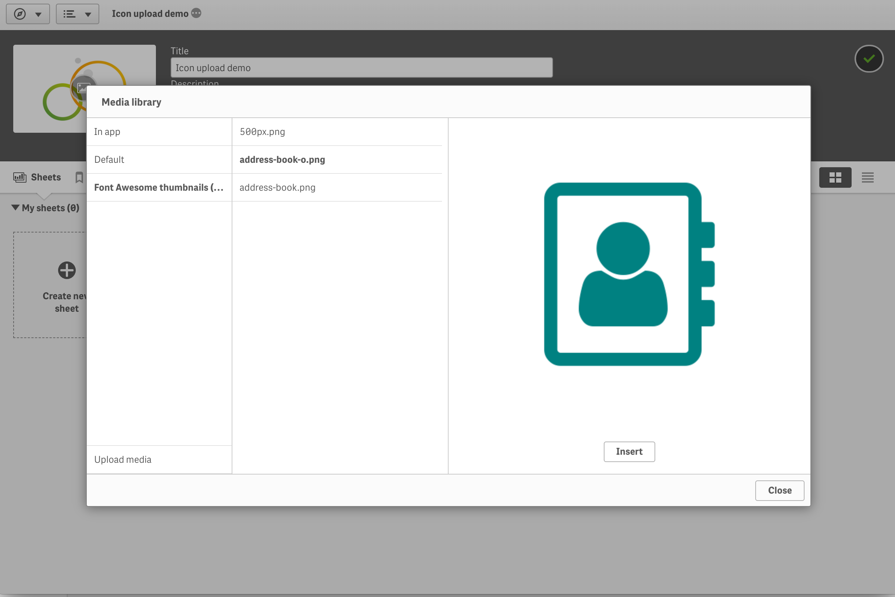

# Butler Icon Upload for Qlik Sense

The "Butler icon upload" tool makes it easy to use free, professional quality icons and images in Qlik Sense.


## Features
* Thousands of free icons available, including Google Material Design, Font Awesome and others. 
* The upload tool handles any image format accepted by Qlik Sense.
* Batch upload of icons and images to Qlik Sense. No more 50-at-a-time uploads. 
* The tool was written with Sense enterprise in mind. Should be possible to adopt to Qlik Sense desktop too.

## Installation

The tool is built using Node.js, please refer to the [Node.js site](https://nodejs.org/en/) for installation instructions for your platform (OSX/Windows/Linux).  
Butler Icon Upload was developed on OSX, using Node.js 8.9.4. Your milage on especially Windows may vary.

If you want to convert existing icon fonts to bitmap images, you also need to install [Icon Font to PNG](https://github.com/Pythonity/icon-font-to-png). This utility is not needed if your images are already in bitmap (png or jpg) format. 

With that in place, you should install the actual upload tool.

* Download the tool from the [releases page](https://github.com/ptarmiganlabs/butler-icon-upload/releases).
* Unzip to suitable location, for example ~/butler-icon-upload. cd into this directory.
* Install dependencies by running `npm install`.

The final tool you need is [ImageMagick](https://www.imagemagick.org). This might be hard to run on a Windows computer, so Linux or OSX is recommended. 


Test your work so far. You should see output similar to the below.

```
proton:butler-icon-upload goran$ node icon_uploader.js
Usage: icon_uploader.js -i [path/to/icon/files] -c [content library name]

Options:
  --version             Show version number                            [boolean]
  -h, --help            Show help                                      [boolean]
  -i, --iconfolder                                                    [required]
  -c, --contentlibrary                                                [required]

Examples:
  node icon_uploader.js -i ./icons -c "My   Uploads icons in ./icons folder to
  icons"                                    content library named "My icons"

Missing required arguments: i, c

```

Let's test the "Icon Font to PNG" tool too:

```
proton:butler-icon-upload goran$ icon-font-to-png
usage: icon-font-to-png [-h] [--list] [--download {font-awesome,octicons}]
                        [--ttf TTF-FILE] [--css CSS-FILE] [--size SIZE]
                        [--scale SCALE] [--color COLOR] [--filename FILENAME]
                        [--keep_prefix]
                        [icons [icons ...]]
icon-font-to-png: error: You have to provide CSS and TTF files
```

And ImageMagick:

```
proton:butler-icon-upload goran$ convert
Version: ImageMagick 7.0.7-22 Q16 x86_64 2018-01-22 http://www.imagemagick.org
Copyright: © 1999-2018 ImageMagick Studio LLC
License: http://www.imagemagick.org/script/license.php
Features: Cipher DPC HDRI Modules
Delegates (built-in): bzlib freetype jng jpeg ltdl lzma png tiff xml zlib
Usage: convert [options ...] file [ [options ...] file ...] [options ...] file

Image Settings:
  -adjoin              join images into a single multi-image file
  -affine matrix       affine transform matrix
  -alpha option        activate, deactivate, reset, or set the alpha channel
  -antialias           remove pixel-aliasing
  -authenticate password
                       decipher image with this password
  -attenuate value     lessen (or intensify) when adding noise to an image
  -background color    background color
...
...

```


Great - you now have the tools needed to batch convert and upload icons and images to Qlik Sense.

## Finding icons
The "Butler Icon Upload" tool does not include any actual icons.  
Instead, you need to find these elsewhere. The good news is that there are various online resources from where you can download professional quality icon sets.

Some of the more commonly used icon sets are Google's [Material Design](https://material.io/icons/) and [Font Awesome](https://fontawesome.com/), but there are many others too.

If you download icons from some online source, you need to get a) a css file for the webfont, and b) the webfont file itself.

### Download icons
[IcoMoon](https://icomoon.io/app/#/select) works great for getting the needed icon resources. It is basically a web app that wraps some of the most common icon sets in a nice web UI. Select the icons you want - let it be 5 or 500 - click download and you are done.
The app also offers IcoMoon's own icon sets for purchase. 

IcoMoon is very easey to use, but let's take a look at how the hundreds of icons in Font Awesome can be downloaded:

1. Go to IcoMoon's [selection page](https://icomoon.io/app/#/select).
2. Click the "Add Icons From Library" link.
3. Scroll down until you find the Font Awesome library. Add it.
4. Select the icons you are interested in, or select all icons by clicking the hamburger menu to the right, then "Select All".
5. Click the "Generate Font" link in the lower right.
6. After a few seconds you will get a download link. Click it to download the icons.
7. You now have a file called icomoon.zip. Unzip it to for example ~/butler-icon-upload/fonts/fontawesome. cd to that directory.

We are only interested in the style.css and fonts/icomoon.ttf files, feel free to delete the rest.


## Convert icons to bitmaps
You are now ready to convert the icon webfonts to bitmap images. 

First make sure you are in the correct place: 

   ```
	proton:fontawesome goran$ pwd
	/Users/goran/code/butler-icon-upload/fonts/fontawesome
	proton:fontawesome goran$ ls -la
	total 80
	drwx------@ 4 goran  staff    128 Mar 28 22:02 .
	drwxr-xr-x  6 goran  staff    192 Mar 28 21:54 ..
	drwxr-xr-x@ 6 goran  staff    192 Mar 21 09:21 fonts
	-rwxr-xr-x@ 1 goran  staff  37863 Mar 21 09:21 style.css
	proton:fontawesome goran$
   ```

Then run a small script in the "script" directoy that will 

1. Extract the images from the icon fonts. The square, exported images will be placed in a new folder called "exported".
2. Convert the images to correct size and aspect ratio. The resulting images will be placed in a directory called "thumbnail". 


```
proton:fontawesome goran$ ../../script/icon_square_to_rect.sh teal
~/code/butler-icon-upload/fonts/fontawesome ~/code/butler-icon-upload/fonts/fontawesome
Exporting icon '500px' as '500px.png'(256x256 pixels)
Exporting icon 'address-book' as 'address-book.png'(256x256 pixels)
Exporting icon 'address-book-o' as 'address-book-o.png'(256x256 pixels)
Exporting icon 'address-card' as 'address-card.png'(256x256 pixels)
...
...
Exporting icon 'yoast' as 'yoast.png'(256x256 pixels)
Exporting icon 'youtube' as 'youtube.png'(256x256 pixels)
Exporting icon 'youtube-play' as 'youtube-play.png'(256x256 pixels)
Exporting icon 'youtube-square' as 'youtube-square.png'(256x256 pixels)

All done
...
...
yoast.png
youtube-play.png
youtube-square.png
youtube.png
~/code/butler-icon-upload/fonts/fontawesome
proton:fontawesome goran$
```

The "thumbnail" folder now contains images suitable for upload to Qlik Sense.

## Uploading icons to Qlik Sense

### Configuration
The upload tool relies on certificates to authenticate with Qlik Sense. These needs to be made available to the upload tool:

1. Export a set of certificates from the Sense QMC. 
2. Copy config/default_template.yaml to config/default.yaml
3. Edit default.yaml so it points to your Sense server and certificates.


Note!  
Using certificates is powerful and convenient, but you should be careful with the certificates - if they get in the wrong hand they will provide full access to your Sense environment. Thus keep tight control of them, and always maintain strict firewall rules, to ensure that access is only possible from desired network locations. 


### Uploading icons
Before uploading the images to a Sense content library, please keep a couple of things in mind:

* The content library you upload images to must exist. You will get a 404 error if it doesn't.
* Existing images in the content library will be replaced, if there are uploaded images with same names as existing ones.
* Remember to set a suitable security rule on the content library, so (all or some) users can access the images.

Upload the images. Below a small set of three images are uploaded.

```
proton:butler-icon-upload goran$ pwd
/Users/goran/code/butler-icon-upload
proton:butler-icon-upload goran$ node icon_uploader.js --iconfolder ./fonts/fontawesome/thumbnail/ --contentlibrary "Font Awesome thumbnails (teal)"
2018-03-29T06:27:10.298Z - info: Starting Qlik Sense icon uploader
2018-03-29T06:27:10.300Z - info: Log level is: info
2018-03-29T06:27:10.302Z - info: Using icons in folder: /Users/goran/code/butler-icon-upload/fonts/fontawesome/thumbnail
2018-03-29T06:27:10.302Z - info: Uploading icons to Qlik Sense content library: Font Awesome thumbnails (teal)
2018-03-29T06:27:10.303Z - info: Uploading file: /Users/goran/code/butler-icon-upload/fonts/fontawesome/thumbnail/500px.png
2018-03-29T06:27:10.310Z - info: Uploading file: /Users/goran/code/butler-icon-upload/fonts/fontawesome/thumbnail/address-book-o.png
2018-03-29T06:27:10.311Z - info: Uploading file: /Users/goran/code/butler-icon-upload/fonts/fontawesome/thumbnail/address-book.png
proton:butler-icon-upload goran$
```

You should now be able to access the images from within Sense apps:




## Troubleshooting

* Make sure port 4242 (on the Sense server where QRS is running) accepts connections from the computer where you run the icon upload tool.
* Running the upload tool itself should be fine on Windows (not tested though). Running the image processing tools (Magick etc) will be difficult on Windows. Possibly possible, not tested though.


## Changelog
The changelog is available on the releases page.


## References & resources
* At [Ptarmigan Labs](https://ptarmiganlabs.com) you find various Qlik Sense related blog posts, including a couple on how to use icons in Qlik Sense.
* Additional DevOps/SenseOps related tools are available on my [Github page](https://github.com/ptarmiganlabs).
* Qlik's [help pages](https://help.qlik.com) are good.


